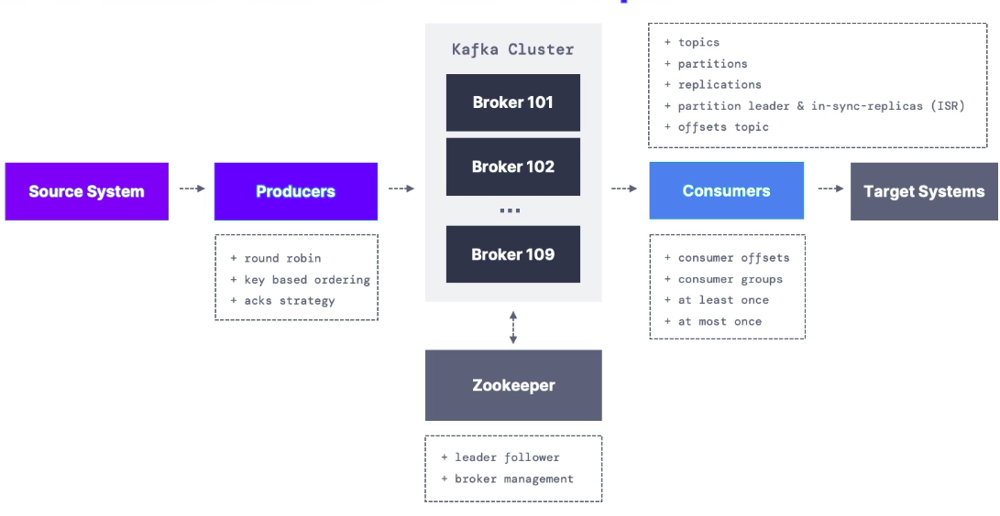

# Introdution to Kafka
## 01. Introduction to kafka
- **<ins>About / Introduction</ins>**
  - Apache Kafka is an open-source distributed event streaming platform used by thousands of companies for high-performance data pipelines, streaming analytics, data integration, and mission-critical applications.
  - Created by `LinkedIn`,now mainly maintained by IBM, Cloudera, Confluent.
  - Distributed, fault tolerant, resilient architecture.
  - ***Horizontal Scalability:***
    - Can scale upto *100s of brokers*.
    - Can scale to millions of messages per second.
  - **Core Capabilities:**
    - ***High Throughput:***
      - Deliver messages at network limited throughput using a cluster of machines with latencies as low as 2ms.
    - ***Scalable:***
      - Scale production clusters up to a thousand brokers, trillions of messages per day, petabytes of data, hundreds of thousands of partitions. Elastically expand and contract storage and processing.
    - ***Permanent storage:***
      - Store streams of data safely in a distributed, durable, fault-tolerant cluster.
    - ***High availability:***
      - Stretch clusters efficiently over availability zones or connect separate clusters across geographic regions.
  - **Ecosystem:**
    - ***Built-in Stream Processing:***
      - Process streams of events with joins, aggregations, filters, transformations, and more, using event-time and exactly-once processing.
    - ***Connect To Almost Anything:***
      - Kafka’s out-of-the-box Connect interface integrates with hundreds of event sources and event sinks including Postgres, JMS, Elasticsearch, AWS S3, and more.
    - ***Client Libraries:***
      - Read, write, and process streams of events in a vast array of programming languages.
    - ***Large Ecosystem Open Source Tools:***
      - Large ecosystem of open source tools: Leverage a vast array of community-driven tooling.
    - ***Typical Kafka Ecosystem***
    

      
    

  - **Trust & Ease Of Use:**
    - ***Mission Critical:***
      - Support mission-critical use cases with guaranteed ordering, zero message loss, and efficient exactly-once processing.
    - ***Trusted By Thousands of Orgs:***
      - Thousands of organizations use Kafka, from internet giants to car manufacturers to stock exchanges. More than 5 million unique lifetime downloads.
    - ***Vast User Community:***
      - Kafka is one of the five most active projects of the Apache Software Foundation, with hundreds of meetups around the world.
    - ***Rich Online Resources:***
      - Rich documentation, online training, guided tutorials, videos, sample projects, Stack Overflow, etc.
  - **Use cases:**
    - *Messaging System*
    - *Activity tracking*
    - *Gather matrics from many different locations*
    - *Application logs gathering* (first use case of kafak)
    - *Stream processing* (Using kafka stream API)
    - *Decouple system dependency*
    - *Integration with Spark, Hadoop, Flink, Storm and many other BigData technologies.*
    - *Microservices pub-sub*
  - **Applications:**
    - ***Netflix:*** Apply recommendations in real-time while user watches the shows.
    - ***Uber:*** Collect User, Cab & trip data in realtime to forecast demand and compute surge pricing.
    - ***LinkedIn:*** Prevent spam & collect user interactions to make better connection recommendataions in realtime. 

- **<ins>References:</ins>**
  - [https://kafka.apache.org/](https://kafka.apache.org/)

---

## 1. Kafka Topics, partitions and offsets
- **<ins>About / Introduction</ins>**
  - ***Kafka Topics*** are a particular stream of data inside kafka cluster. In a cluster we can have many topics e.g. - logs, purchases, twitter_tweets, trucks_gps and so on.
    - We can think of a Topic as a table in database but without all the constraints. But we can't query topics.
    - Instead, we use `Kafka Producers` to send data and `Kafka Consumers` to receive data.
  - We can as much as Topic in kafka cluster, it can be identified by it's name.
  - Kafak Topics support any kind of message formats e.g. JSON, Avro, Text file, binary etc..
  - The squence of messages is called Data Stream.
  - **Partitions and offset:**
    - Topics are split in partitions (eg. 100 partitions).
    - Messages sent to Kafka Topic will endup in these partitions and message within each partition is going to be ordered.
      - Data is assigned randomly to a partition unless a key is provided (more on this later).
      - All the messages in partitions are assigned an message ID (aka Offset) (autoincrement 0,1,2,3,4,.....).
      - The message ID is assigned at the `Partition Level`. Each partition maintains it's own independent sequence of `offsets`, starting `0`. Thesse offsets are unique only within the given partition. Other partitions can also have same offset.
      - Offsets are not reused even if the message is removed from the partition.
    - When consuming a message combination of partition_number and the offset is used to uniquely identify a message in a topic.
    - Consumers track offsets independenctly for each partition they consume from.
  - ***Kafka Topics are immutable:*** Once the data is written to a partition, it can't be updated or deleted.
  - ***Data Storage:*** Data is kept only for a limited time (default is one week - configurable)  
  - **Message ordering:** Order of messsages is guaranteed only within a partition but not accross the partitions.
    - Here message ordering means reading messages in ordered sequence as per offset number.

- **<ins>References:</ins>**
  - [https://developer.confluent.io/courses/apache-kafka/producers/?utm_medium=sem&utm_source=google&utm_campaign=ch.sem_br.nonbrand_tp.prs_tgt.dsa_mt.dsa_rgn.india_lng.eng_dv.all_con.confluent-developer&utm_term=&creative=&device=c&placement=&gad_source=1&gclid=Cj0KCQiAj9m7BhD1ARIsANsIIvDL5iHFIKlmflFV-JZ0nsPa-33AVBuBxRBlnagQtFar5bgoO0Eygz8aAvm7EALw_wcB](https://developer.confluent.io/courses/apache-kafka/producers/?utm_medium=sem&utm_source=google&utm_campaign=ch.sem_br.nonbrand_tp.prs_tgt.dsa_mt.dsa_rgn.india_lng.eng_dv.all_con.confluent-developer&utm_term=&creative=&device=c&placement=&gad_source=1&gclid=Cj0KCQiAj9m7BhD1ARIsANsIIvDL5iHFIKlmflFV-JZ0nsPa-33AVBuBxRBlnagQtFar5bgoO0Eygz8aAvm7EALw_wcB)

---

## 2. Kafka - Producers, message keys and Serialization
- **<ins>About / Introduction</ins>**
  - **Kafka Producer:**
    - A producer is the one which publishes or writes data to the topics within different partitions.
    - Producers knows / decides that, what data should be written to which partition and broker (server). The user does not require to specify the broker and the partition.
    - In case of Kafka broker failures, Producers will automatically recover.
    - **Strategies:**
      - A producer uses following strategie//s to write data to the cluster:
        - *Message Keys*
        - *Acknowledgement*
    - **Message Keys:**
      - Apache Kafka enables the concept of the key to send the messages in a specific order in specific partition. 
      - The Key enables the producer with two choices, i.e., either to send data to each partition (automatically) or send data to a specific partition only. Sending data to some specific partitions is possible with the message keys.
      - If the producers apply key over the data, that data will always be sent to the same partition always. But, if the producer does not apply the key while writing the data, it will be sent in a round-robin manner. This process is called load balancing.
      - In Kafka, load balancing is done when the producer writes data to the Kafka topic without specifying any key, Kafka distributes little-little bit data to each partition.
      - There are two ways to know that the data is sent with or without a key:
        - ***If the value of key=NULL:***
          - It means that the data is sent without a key. Thus, it will be distributed in a round-robin manner (i.e., distributed to each partition).
        - ***If the value of the key!=NULL:***
          - It means the key is attached with the data, and thus all messages will always be delivered to the same partition (Hashing).
      - Typical message in kafka:
        <table style="border: 1px solid black">
          <tr>
            <td>
              Key-Binary  
              (can be null)
              </td>
            <td>
              Value-Binary  
              (can be null)
            </td>
          </tr>
          <tr>
            <td colspan="2">
              Compression type   
              (none, gzip, snappy, lz4, zstd)
            </td>
          </tr>
          <tr>
            <td colspan="2">
              Headers (Optional)   
              
 
              |-----------------|  
              | Key &nbsp;&nbsp;| value &nbsp;&nbsp; | 
              |-----------------|  
              | Key &nbsp;&nbsp;| value &nbsp;&nbsp; | 
              |-----------------|  
              

            </td>
          </tr>
          <tr>
            <td colspan="2">
              Partition + Offset
            </td>
          </tr>
          <tr>
            <td colspan="2">
              Timestamp (System or user set)
            </td>
          </tr>
        </table>
    - **Acknowledgment:**
      - In this strategy, the producer can get a confirmation of its data writes by receiving the following acknowledgments:
        - ***acks=0:*** 
          - This means that the producer sends the data to the broker but does not wait for the acknowledgement. 
          - This leads to possible data loss because without confirming that the data is successfully sent to the broker or may be the broker is down, it sends another one.
        - ***acks=1:*** 
          - This means that the producer will wait for the leader's acknowledgement. 
          - The leader asks the broker whether it successfully received the data, and then returns feedback to the producer. In such case, there is limited data loss only.
        - ***acks=all:*** 
          - Here, the acknowledgment is done by both the leader and its followers. 
          - When they successfully acknowledge the data, it means the data is successfully received. In this case, there is no data loss.
  - **Message Serializer:**
    - Kafka only accepts `bytes` as input from `Producers` and sends only `bytes` as output to `Consumers`.
    - Message Serialization means transforming objects/data into bytes.
      - The serialization is used only on the value and the key.
      - It uses the Serializers provided **KeySerializer** & **ValueSerializer** serialize the corresponding data.
        - **Serializers:** `IntegerSerializer`, `StringSerializer` etc.
        - e.g. 
          - **Key Object is 123** => *KeySerializer=IntegerSerializer*
          - **Value Object is 'Hello world'**  => *ValueSerializer=StringSerializer*
    - **Common Serializers:**
      - *String (including JSON)*
      - *Int, Float*
      - *Avro*
      - *Protobuf*
    - **Kafka Message Key Hashing:**
      - A **Kafka Partitioner** is a code logic that takes a record / message and determines to which partition to send the record to.
      - The it uses key hashing to determine the partition.
      - By default *kafka partitioner* uses **murmur2 algorithm** as below.
        - `targetPartition = Math.abs(Utils.murmur2(keyBytes)) % (numPartitions - 1)` 
- **<ins>References:</ins>**
  - [https://www.javatpoint.com/apache-kafka-producer](https://www.javatpoint.com/apache-kafka-producer)

---

## 3. Kafka Consumer and Deserialization
- **<ins>About / Introduction</ins>**
  - **Kafka Consumers** is used to reading data from a topic (pull model) and remember a topic again is identified by its name. So the consumers are smart enough and they will know which broker to read from and which partitions to read from. 
    - In case of broker failures, the consumers know how to recover and this is resiiency property of Apache Kafka. 
    - A consumer can read data from more than one partions / brokers. They know in advance that from which broker / parition they need to read data from and also in case of broker failures, they know how to recover data.
    - Data is read from low to high offset within each partition.
  - **Consumer Deserialization:**
    - Deserialization is the process of transformating bytes into objects / data. This is used on the key and the value of the message.
    - It uses the Serializers provided by **KeyDeserializer** & **ValueDeserializer** to deserialize the key and the value.
      - **Serializers:** `IntegerSerializer`, `StringSerializer` etc.
        - e.g. 
          - **Key Object is 123** => *KeySerializer=IntegerSerializer*
          - **Value Object is 'Hello world'**  => *ValueSerializer=StringSerializer*
    - **Common Serializers:**
      - *String (including JSON)*
      - *Int, Float*
      - *Avro*
      - *Protobuf*
- **<ins>Notes:</ins>**
  - The Serialization / Deserialization type must not change during a `Topic` lifecycle.
  - If we need to change the Data type of a topic, we must create a new Topic and shared with details so consumers can make necessary changes to consume data from new Topic. 

- **<ins>References:</ins>**
  - [https://www.geeksforgeeks.org/apache-kafka-serializer-and-deserializer/](https://www.geeksforgeeks.org/apache-kafka-serializer-and-deserializer/)
  - [https://www.javatpoint.com/apache-kafka-consumer-and-consumer-groups](https://www.javatpoint.com/apache-kafka-consumer-and-consumer-groups)

---

## 4. Kafka - Consumer groups
- **<ins>About / Introduction</ins>**
  - A consumer group is a group of multiple consumers which visions to an application basically. Each consumer present in a group reads data directly from the exclusive partitions.
    - We can have multiple consumer groups on the same topic. and all consumers from these groups can read parallely from the Topic partitions.
    - **Note:** Only one consumer will be assigned to 1 partition but one consumer can read from multiple partitions.
  - In case, the number of consumers are more than the number of partitions, some of the consumers will be in an inactive state. 
    - Somehow, if we lose any active consumer within the group then the inactive one can takeover and will come in an active state to read the data.
  - But, how to decide which consumer should read data first and from which partition ?
    - For such decisions, consumers within a group automatically use a **GroupCoordinator** and one **ConsumerCoordinator**, which assigns a consumer to a partition. This feature is already implemented in the Kafka.
  - **To Create disntinct consumer groups** we'll use the consumer property *group.id*.
  - **Consumer Offsets:**
    - Apache Kafka provides a convenient feature to store an offset value for a consumer group. It *stores an offset value* to know at which partition, the consumer group is reading the data. 
      - As soon as a consumer in a group reads data, Kafka automatically commits the offsets, or it can be programmed. 
      - These offsets are committed live in a topic known as ***__consumer_offsets*** (*internal kafka topic*). 
      - This feature was implemented in the case of a machine failure where a consumer fails to read the data. So, the consumer will be able to continue reading from where it left off due to the commitment of the offset. 
    - **Delivery Semantics for consumers**
      - By default, Java consumers will automatically commits offset (at least once).
      - There are 3 delivery semantics, if we choose to commit ***manually***:
        - **At least once (usually preferred):**
          - Offsets are commited after the message is processed. As if something goes wrong the mesage will be read again.
          - This can result in duplicate processing of message. Hence ensure that our processing is idempotent (reprocessing the message won't impact the system). 
        - **At most once:**
          - Offsets are commited as soon as the message is received.
          - If processing goes wrong, some message will be lost as they won't be read again.
        - **Exactly Once:**
          - For Kafka to Kafka workflows, uses the transactional API (easy with Kafka Streams API)
          - For Kafka to external system workflows, uses idempotent consumers.
- **<ins>References:</ins>**
  - [https://www.javatpoint.com/apache-kafka-consumer-and-consumer-groups](https://www.javatpoint.com/apache-kafka-consumer-and-consumer-groups)

---

## 5. Kafka Brokers & Topics [***In progress***]
- **<ins>About / Introduction</ins>**
  - **Broker:**
    - Also know as ***Bootstrap Server***, the Kafka broker can be defined as one of the core components of the Kafka architecture aka the Kafka server and a Kafka node. We define a Kafka cluster when there is more than one broker (servers) present. 
    - Each broker in the cluster has its own ***unique number ID (integer)***.
    - The Kafka broker is responsible for transferring the conversation that the publisher is pushing in the Kafka log commit and the subscriber shall be consuming these messages.
      - It has also been seen that an individual broker can handle thousands of requests for reads and writes per second. When no performance impact is seen then every broker in the Kafka cluster can handle terabytes of messages.
      - Also, the Kafka producers push a message to a broker, then the broker receives the data record and stores it. This stored data remains over the disk defined by a distinct offset. However, the partition, topic, and offset of a broker allow consumers to fetch messages.
    - While the Kafka cluster consists of various brokers. Kafka cluster implements the Zookeeper for maintaining the state of the cluster. ZooKeeper also performs the broker leader election.
    - Kafka Broker is structured as a KafkaServer, that is hosting various topics. The stated topics must be partitioned across the various brokers spread in a Kafka cluster. 
      - The single broker is hosting the topic partitions for more than one topic, while a topic is partitioned for a single partition. 
    - Some big clusters can have over 100 brokers.
  - **Topics:**
    - A topic is a logical channel or category to which messages (or records) are published. Producers send data to topics, and consumers subscribe to topics to consume the data. Topics allow Kafka to organize and manage streams of data in a structured way.
      - **Terms:**
        - **Data Streams:** 
          - A topic represents a stream of records (messages), and these records are ordered within the topic.
        - **Partitions:** 
          - Each topic can be split into multiple partitions, which allow Kafka to scale horizontally. Each partition is an ordered log of records, and data within a partition is stored in a sequence. Partitions enable parallelism in Kafka, as producers can write to different partitions and consumers can read from them independently.
        - **Producers and Consumers:**
          - **Producers** write data to topics. They can specify the topic name when sending a message.
          - **Consumers** subscribe to topics to receive data. They can consume messages from one or more partitions of a topic.
        - **Log-based Storage:** 
          - Topics are stored as logs, meaning records are kept for a specific retention period or until the storage limit is reached, allowing consumers to read messages at any time within the retention window.
        - **Durability:** 
          - Kafka topics are fault-tolerant. Messages are replicated across multiple brokers in the cluster, which ensures that data is available even in the event of node failures.
        - **Scaling:** 
          - Topics can scale based on the number of partitions. More partitions allow higher throughput and parallel consumption but may introduce complexity in managing the partitions and maintaining order across them.
        - **Topic Naming:** 
          - Topics are identified by unique names. Producers and consumers need to know the topic name to send and consume messages, respectively.
  - **Kafaka Broker Discovery:**
    - Refers to the process by which Kafka clients (producers, consumers, or other services) discover and connect to the available Kafka brokers in a Kafka cluster.
    - Here's how Kafka broker discovery works:
      - **Initial Connection to the Cluster:**
        - When a Kafka client starts, it needs to connect to at least one broker in the cluster to get information about the rest of the brokers in the cluster.
        - The client is typically provided with a list of initial brokers (a small set of brokers), which can be hardcoded in the configuration or passed dynamically. These brokers can be any brokers that are part of the Kafka cluster.
      - **Metadata Fetch:**
        - After the client connects to one of the initial brokers, it requests metadata information from that broker. 
          - *The metadata includes:*
          - A list of all available brokers in the cluster.
          - The topics and partitions each broker is responsible for.
          - Which broker is the leader for each partition (i.e., the broker that is actively accepting writes for that partition).
      - **Updating Broker List:**
        - Once the client receives the metadata information, it can update its internal list of brokers and cache that information.
        - If a broker fails or new brokers are added, the client can periodically refresh the metadata to stay up-to-date with the cluster's state.
      - **Handling Failures:**
        - If the initial broker provided becomes unreachable or fails, the client can use the updated broker list to attempt connections to other brokers in the cluster.
        - Kafka clients usually implement automatic failover by retrying connections to other brokers or automatically updating their metadata when necessary.
> **Note:** After connecting to any Broker (called a bootstrap broker), client receives a metadata with list of all brokers and then it will be able to connected to the entire cluster/broker (Kaka clients hae smart mechanism for that)
- **<ins>References:</ins>**
  - [ChatGPT](ChatGPT)
---
## 6. Kafka Topic Replication Factors
- **<ins>About / Introduction</ins>**
  - Apache Kafka is a distributed software system in the Big Data world. Thus, for such a system, there is a requirement to have copies of the stored data. 
    - In Kafka, each broker contains some sort of data. But, what if the broker or the machine fails down? The data will be lost. *Precautionary*, Apache Kafka **enables a feature of replication to secure data loss** even when a broker fails down. 
    - To do so, a replication factor is created for the topics contained in any particular broker. 
      - A replication factor is the number of copies of data over multiple brokers. The replication factor value should be greater than 1 always (PROD) (usually between 2 or 3, most commonly 3). 
        - This helps to store a replica of the data in another broker from where the user can access it.
    - It is obvious to have confusion when both the actual data and its replicas are present. The cluster may get confuse that which broker should serve the client request. 
    - To remove such confusion, the following task is done by Kafka:
      - It chooses one of the broker's partition as a leader, and the rest of them becomes its followers. At any time only one broker can be the partition leader.
        - **Producers** can only send data to the broker that is leader of a partition.
      - The followers(brokers) will be allowed to synchronize the data. But, in the presence of a leader, none of the followers is allowed to serve the clien t's request. These replicas are known as ISR(in-sync-replica). So, Apache Kafka offers multiple **ISR (in-sync-replica)** for the data.
    - Therefore, only the leader is allowed to serve the client request. The leader handles all the read and writes operations of data for the partitions. The leader and its followers are determined by the zookeeper.
  - **Consumers: Replica fetching:**
    - Since Kafka 2.4+, it's possible to configure consumers to read data from closest  replica.
    - This may help to reduce the latency and also decrease network costs if using cloud (if broker replica is in same data center).
- **<ins>References:</ins>**
  - [https://www.javatpoint.com/kafka-topic-replication](https://www.javatpoint.com/kafka-topic-replication)

---

## 6. Kafka: Zookeeper
- **<ins>About / Introduction</ins>**
  - A ZooKeeper is used to store information about the Kafka cluster and details of the consumer clients. It manages brokers by maintaining a list of them. 
    - Also, a ZooKeeper is responsible for choosing a leader for the partitions. 
    - It doesn't store consumer offsets starting Kafka > v0.10.
  - If any changes like a broker die, new topics, etc., occurs, the ZooKeeper sends notifications to Apache Kafka. 
  - For reliable ZooKeeper service, you should deploy ZooKeeper in a cluster(multi-server) known as an ensemble. As long as a majority of the ensemble are up, the service will be available. 
  - A ZooKeeper is designed to operate with an odd number of Kafka servers (1, 3, 5, 7 - Never more than 7 usually). Zookeeper has a leader server that handles all the writes, and rest of the servers are the followers who handle all the reads. 
    - However, a user does not directly interact with the Zookeeper, but via brokers. 
    - **Kafka 2.x** server can't run without a zookeeper server. It is ***mandatory to run the zookeeper server***.
    - Now from **Kafka 3.x** it can run without a ***Zookeeper(KIP-500)*** server, using ***Kafka Raft (KRaft)*** instead.
      - Kafka 3.3.1 (KIP-833) implements the Raft protocol (KRaft) in order to relace Zookeeper and is PROD ready.
    - **Kafka 4.x** will be released only with KRaft (no Zookeeper).
    - The reason of Zookeeper migration is it'sless secure than *Kafka*, and therefore Zookeeper ports should only be opened to allowed traffic from Kafka brokers and not from Kafka clients. 
  - **KIP-500: (Replace ZooKeeper with a Self-Managed Metadata Quorum)** 
    - The controller nodes comprise a Raft quorum which manages the metadata log. This log contains information about each change to the cluster metadata. Everything that is currently stored in ZooKeeper, such as topics, partitions, ISRs, configurations, and so on, will be stored in this log.
    - Using the Raft algorithm, the controller nodes will elect a leader from amongst themselves, without relying on any external system. The leader of the metadata log is called the **active controller**. 
      - The active controller handles all RPCs made from the brokers. The follower controllers replicate the data which is written to the active controller, and serve as hot standbys if the active controller should fail. Because the controllers will now all track the latest state, controller failover will not require a lengthy reloading period where we transfer all the state to the new controller.
    - Just like ZooKeeper, Raft requires a majority of nodes to be running in order to continue running.
      - Therefore, a three-node controller cluster can survive one failure.
      - A five-node controller cluster can survive two failures, and so on.
    - Periodically, the controllers will write out a snapshot of the metadata to disk. While this is conceptually similar to compaction, the code path will be a bit different because we can simply read the state from memory rather than re-reading the log from disk.
- **<ins>Note:</ins>**
  - **With Kafka Client?**
    - Overtime, the Kafka clients and CLI have been migrated to *leverage the brokers as a connection endpoint* instead of Zookeeper.
    - Since **Kafka 0.10**, consumers store offset Kafka & Zookeeper, and *must not connect to Zookeeper as it's deprecated.*
    - Since, **Kafka 2.2**, the *kafka-topics.sh* references *Kafka Brokers* and not Zookeeper for topic management (creation, deletion, ... etc) and Zoookeeper CLI argument is deprecated.
      - All the APIs and Commands that were previously leveraging Zookeeper are migrated to use Kafaka instead, so that when clusters are migrated to be without Zookeeper, the change is invisible to the clients.
      -  
- **<ins>References:</ins>**
  - [https://cwiki.apache.org/confluence/display/KAFKA/KIP-500%3A+Replace+ZooKeeper+with+a+Self-Managed+Metadata+Quorum](https://cwiki.apache.org/confluence/display/KAFKA/KIP-500%3A+Replace+ZooKeeper+with+a+Self-Managed+Metadata+Quorum)
  - [https://zookeeper.apache.org/doc/r3.3.3/zookeeperAdmin.html#:~:text=Because%20Zookeeper%20requires%20a%20majority,do%20not%20constitute%20a%20majority.](https://zookeeper.apache.org/doc/r3.3.3/zookeeperAdmin.html#:~:text=Because%20Zookeeper%20requires%20a%20majority,do%20not%20constitute%20a%20majority.)
  - [Course Lecture](https://www.udemy.com/course/apache-kafka/learn/lecture/11566886?start=0#content)
  - 
---
