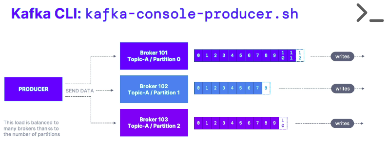
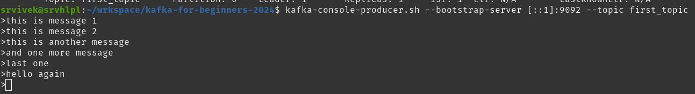
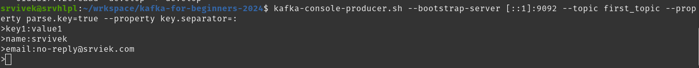
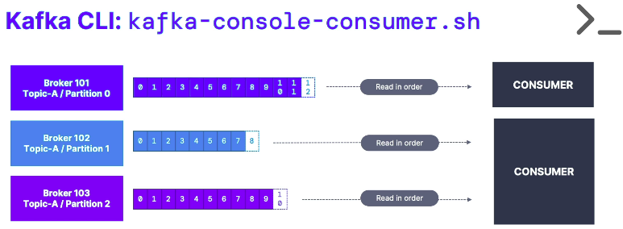
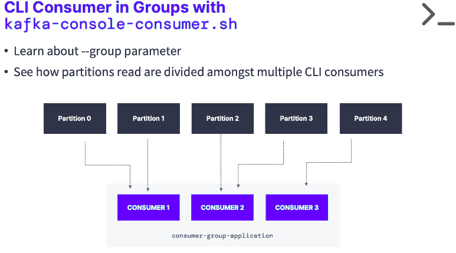
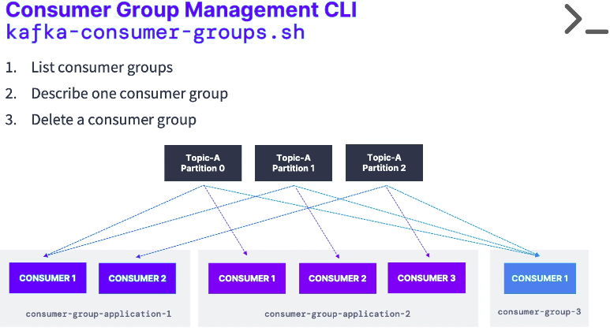

# Kafka: Setup and CLI (Command Line Interface)
## 0. Resources

| Service | Port | Info |
| ------- | ---- | ---- |
| Kafka  | 9092 | Default port |  
| Zookeeper | 2181 | Default port |

---
## 1. Kafka: Install Kafka (Conductor) docker setup and local CLI
- **<ins>About / Introduction</ins>**
  - Setup `Conduktor Kafka` in local docker.
- **<ins>Steps</ins>**
  - ***Project Setup:*** Make sure Java SDK 11 or higher is installed and is updated in PATH.
  - ***Step-1:*** Install `Conducktor` in docker.
    - Download *docker-compose.yml*
      - [curl -L https://releases.conduktor.io/quick-start -o docker-compose.yml](curl -L https://releases.conduktor.io/quick-start -o docker-compose.yml)
  - ***Step-2:*** Start the services
    - `docker compose up -d --wait`
      - **-d:** Detached mode: Run containers in the background.
      - **--wait:** Wait for services to be running|healthy. Implies detached mode.
  - ***Step-3:*** Launch Service.
    - Go to ***http://localhost:8080/***
      - Requires *sign-up* for first  time login.
  - ***Step-4:*** *Kafka Local Binary/executables setup*
    - Download latest kafka binaries from [https://kafka.apache.org/downloads](https://kafka.apache.org/downloads).
    - **Extract** it to local and **set the path** *(preferebly in ~/.profile file)* to it's bin directory.
  - ***Step-5:*** Starting *Zookeeper server*
    - **Command:** *zookeeper-server-start.sh /path/to/kafka-2.13-3.9.0/config/zookeeper.properties*
      - Zookeeper requires *zookeeper.properties* file to start/boot.
      - We can use the default *zookeeper.properties* available as part of *kafka-executables*.
      - Change the **Default Data directory** *dataDir=/tmp/zookeeper* in *zookeeper.properties*, the directory where the snapshot is stored.
  - ***Step-6:*** Starting Kafka Server (broker)
    - **Command:** *kafka-server-start.sh /path/to/kafka-2.13-3.9.0/config/server.properties*
      - Change the **Default logs directory** *log.dirs=/tmp/kafka-logs* in *server.properties*
        - It accets a comma separated list of directories under which to store log files.
    - **Default Configuration:** *server.properties*
      - **num.partitions:** If required we can update default default partitions from 1 to 'X' (standar is 3) by updating *num.partitions=3*.
      - **Port:** 
        - **IPv4:** *listeners=PLAINTEXT://localhost:9092*
        - **IPv6:** *listeners=PLAINTEXT://[::1]:9092*
      - **log.dirs:** *log.dirs=/tmp/kafka-logs/broker-0* 
      - **Disable auto topic creation:**
        - Add following property in kafka *server.properties*
          - `auto.create.topics.enable=false`
  - ***Step-7:*** Lanch 2nd Kafka broker.
    - Create new *server-broker-1.properties* and update below default configuration.
      - **ID:** *broker.id=1*
      - **Port:** 
        - **IPv4:** *listeners=PLAINTEXT://localhost:9093*
        - **IPv6:** *listeners=PLAINTEXT://[::1]:9093*
      - **log.dirs:** *log.dirs=/tmp/kafka-logs/broker-1*
    - **Command:** Launch Kafka server
      - *kafka-server-start.sh ./server-broker-1.properties*
  - ***Step-8:*** Stopping servers.
    - **First** stop Kafka server.
    - **Second** stop Zookeeper server.

> Note: Trobleshoot connectivity issues on Windows WSL 2 [Connecting-to-kafka-running-on-windows-wsl-2/](https://docs.conduktor.io/desktop/kafka-cluster-connection/setting-up-a-connection-to-kafka/connecting-to-kafka-running-on-windows-wsl-2/).

- **<ins>References:</ins>**
  - [https://cwiki.apache.org/confluence/display/KAFKA/KIP-361%3A+Add+Consumer+Configuration+to+Disable+Auto+Topic+Creation](https://cwiki.apache.org/confluence/display/KAFKA/KIP-361%3A+Add+Consumer+Configuration+to+Disable+Auto+Topic+Creation)
---

## 2. Kafka: Install Kafka with KRAFT (without Zookeeper)
- **<ins>About / Introduction</ins>**
  - Start Kafaka server using KRAFT (without Zookeeper)
- **<ins>Steps</ins>**
  - ***Project Setup:*** Some change/step
  - ***Step-1:*** Generate a new *Cluster UUID*.
    - **Command:** `kafka-storage.sh random-uuid`
  - ***Step-2:*** Format the storage (Log Directories).
    - **Command:** `kafka-storage.sh format -t Nl0GbGlqReSzOsMirclqoQ -c /path/to/kafka-2.13-3.9.0/config/kraft/server.properties`
  - ***Step-3:*** Start Kafka Server using KRAFT configuration properties.
    - **Command:** `kafka-server-start.sh /path/to/kafka-2.13-3.9.0/config/kraft/server.properties`
  - ***Step-4:*** Stopping kafka server
    - Press `Ctrl + C` in terminal.
- **<ins>References:</ins>**
  - [https://learn.conduktor.io/kafka/how-to-install-apache-kafka-on-linux-without-zookeeper-kraft-mode/](https://learn.conduktor.io/kafka/how-to-install-apache-kafka-on-linux-without-zookeeper-kraft-mode/)
---

## 3. Kafka Topics CLI: *kafka-topics.sh*
- **<ins>About / Introduction</ins>**
  - Connecting to Kafka in docker using Kafka CLI commands.
- **<ins>Steps</ins>**
  - ***Project Setup:*** 
    - Ensure all *Zookeeper (Step-5)* and *Kafka (Step-6)* servers are up and running.
    - **Refer,** *Section-1* for setup process.
  - ***Step-1:*** List topics in kafka server.
    - **List all topics (just names):** *kafka-topics.sh --bootstrap-server localhost:19092 --list*
    - **List all topics (with config details):** *kafka-topics.sh --bootstrap-server localhost:19092 --describe*
  - ***Step-2:*** Create a new topic
    - **Create topic:** 
      - **IPv4:** *kafka-topics.sh --bootstrap-server localhost:9092 --topic first_topic --create*
      - **IPv6:** *kafka-topics.sh --bootstrap-server [::1]:9092 --topic first_topic --create*
    - **Note:**
      - *WARNING: Due to limitations in metric names, topics with a period ('.') or underscore ('_') could collide.* 
      - *To avoid issues it is best to use either, but not both.*
      - **Troubleshooting:** 
        - *Error:* *[2025-01-06 10:55:26,226] WARN [AdminClient clientId=adminclient-1] Connection to node -1 (localhost/127.0.0.1:9092) could not be established. Node may not be available. (org.apache.kafka.clients.NetworkClient)*
        - ***Remediation:*** Add below lister configuration in */path/to/kafka/config/server.properties*
  - ***Step-3:*** Create topic with # partition config
  - **Create topic with defined partitions:** 
    - **IPv4:** *kafka-topics.sh --bootstrap-server localhost:9092 --topic second_topic --create --partitions 3*
    - **IPv6:** *kafka-topics.sh --bootstrap-server [::1]:9092 --topic second_topic --create --partitions 3*
  - ***Step-4:*** Create topic with replication factor.
    - **Create topic with defined partitions and replicas**
      - **IPv4:** *kafka-topics.sh --bootstrap-server localhost:9092 --topic third_topic --create --partitions 3 --replication-factor 1*
      - **IPv6:** *kafka-topics.sh --bootstrap-server [::1]:9092 --topic third_topic --create --partitions 3 --replication-factor 1*
      - **Note:**
        - *Replication factor should not be greater than available brokers*
  - ***Step-5:*** Delete a topic
    - **IPv4:** *kafka-topics.sh --bootstrap-server localhost:9092 --topic first_topic --delete*
    - **IPv6:** *kafka-topics.sh --bootstrap-server [::1]:9092 --topic first_topic --delete*
> **Note:** Replace `localhost` with `[::1]` if using IPv6.
- **<ins>All Commands:</ins>**
    ```sh
      ############################
      #####     LOCALHOST    #####
      ############################

      # ****Note: Replace `localhost` with `[::1]` if using IPv6

      # List all topics in Kafka server
      kafka-topics.sh --bootstrap-server localhost:9092 --list 
      kafka-topics.sh --bootstrap-server [::1]:9092 --list

      # Describe all topics in Kafka server with configuration details
      kafka-topics.sh --bootstrap-server localhost:19092 --describe
      kafka-topics.sh --bootstrap-server [::1]:19092 --describe

      # Describe specific topic in Kafka server with configuration details
      kafka-topics.sh --bootstrap-server localhost:9092 --topic first_topic --describe
      kafka-topics.sh --bootstrap-server [::1]:9092 --topic first_topic --describe

      # Create topic named `first_topic`
      kafka-topics.sh --bootstrap-server localhost:9092 --topic first_topic --create
      kafka-topics.sh --bootstrap-server [::1]:9092 --topic first_topic --create

      # Create a topic with name `second_topic` with 3 partitions
      kafka-topics.sh --bootstrap-server localhost:9092 --topic second_topic --create --partitions 3
      kafka-topics.sh --bootstrap-server [::1]:9092 --topic second_topic --create --partitions 3

      # Create a topic with name `third_topic` with 3 partitions and 2 replicas
      # Faile in local: Replication factor should not be greater than available brokers.
      kafka-topics.sh --bootstrap-server localhost:9092 --topic third_topic --create --partitions 3 --replication-factor 2
      kafka-topics.sh --bootstrap-server [::1]:9092 --topic third_topic --create --partitions 3 --replication-factor 2

      # Create a topic (working)
      kafka-topics.sh --bootstrap-server localhost:9092 --topic third_topic --create --partitions 3 --replication-factor 1
      kafka-topics.sh --bootstrap-server [::1]:9092 --topic third_topic --create --partitions 3 --replication-factor 1

      # Delete a topic 
      kafka-topics.sh --bootstrap-server localhost:9092 --topic first_topic --delete
      kafka-topics.sh --bootstrap-server [::1]:9092 --topic first_topic --delete
      # (only works if delete.topic.enable=true)

      # list all active brokers
      zookeeper-shell.sh localhost:2181 ls /brokers/ids
      zookeeper-shell.sh [::1]:2181 ls /brokers/ids
    ```
---
## 4. Kafka Console Producer - *kafka-console-producer.sh*
- **<ins>About / Introduction</ins>**
  - Produce data using *kafka-console-producer.sh* executable/script.
  - **Typical kafka console producer**
    <center>
      
    </center>
- **<ins>Steps</ins>**
  - ***Project Setup:*** *Zookeeper* and at least one *Kafka server* must be running.
  - ***Step-1:*** Push message to topic using CLI *kafka-console-producer.sh*
    - **Command:** *kafka-console-producer.sh --bootstrap-server [::1]:9092 --topic first_topic*
      - This command give a prompt to enter mesages, which will be pushed to the topic.
      - Every new Prompt/Line is a seperate message.
      <center>
        
      </center>
    - **Non existing Topic:** Shows warnning, if topic doesn't exist Creates one with given name.
      - *WARN [Producer clientId=console-producer] The metadata response from the cluster reported a recoverable issue with correlation id 5 : {new_topic=LEADER_NOT_AVAILABLE} (org.apache.kafka.clients.NetworkClient)* 
  - ***Step-2:*** Push message with *producer.properties* for acknowledgement.
    - **Command:** *kafka-console-producer.sh --bootstrap-server [::1]:9092 --topic first_topic **--producer-property acks=all***
  - ***Step-3:*** Push messages with keys
    - **Command:** *kafka-console-producer.sh --bootstrap-server [::1]:9092 --topic first_topic **--property parse.key=true --property key.separator=:***
      - **Note:** It throws error if message is sent without the defined *key seperator*.
    - Producing messages with keys.
      <center>
        
      </center>
  - ***Step-4*** Produce data to all partitions with RoundRobin mechanism.
    - **Command:** *kafka-console-producer.sh --bootstrap-server [::1]:9092 --producer-property partitioner.class=org.apache.kafka.clients.producer.RoundRobinPartitioner --topic first_topic*
    - **Paritioner property:**
      - *org.apache.kafka.clients.producer.RoundRobinPartitioner* class explicity specifies partitioning strategy to distribute the messages if there's more than one parititon.
    - **Note:**
      - Do not use in *PRODUCTION* environment, it's one of the most inefficient Partitioning stretegy.
- **Note:** 
  - Press ***Ctrl + C*** to exit the console.
  - We must create topics with the appropriate number of partitions before producing to them.

- **<ins>All Commands:</ins>**
  ```sh
      ############################
      #####     LOCALHOST    #####
      ############################

      # Crete topic if doesn't exists
      kafka-topics.sh --bootstrap-server localhost:9092 --topic first_topic --create --partitions 1
      kafka-topics.sh --bootstrap-server [::1]:9092 --topic first_topic --create --partitions 1

      # producing
      # For IPv4 use - --bootstrap-server localhost:9092
      kafka-console-producer.sh --bootstrap-server [::1]:9092 --topic first_topic 
      > Hello World
      >My name is Conduktor
      >I love Kafka
      >^C  (<- Ctrl + C is used to exit the producer)


      # producing with properties acknowledge all
      kafka-console-producer.sh --bootstrap-server [::1]:9092 --topic first_topic --producer-property acks=all
      > some message that is acked
      > just for fun
      > fun learning!


      # producing to a non existing topic throws warnning and the topic will be created internally.
      # we must prevent topics from auto creation, check steps section for details.
      kafka-console-producer.sh --bootstrap-server [::1]:9092 --topic new_topic
      > hello world!

      # our new topic only has 1 partition
      kafka-topics.sh --bootstrap-server [::1]:9092 --list
      kafka-topics.sh --bootstrap-server [::1]:9092 --topic new_topic --describe


      # edit config/server.properties or config/kraft/server.properties
      # num.partitions=3
      # produce against a non existing topic again
      kafka-console-producer.sh --bootstrap-server [::1]:9092 --topic new_topic_2
      hello again!

      # this time our topic has 3 partitions
      kafka-topics.sh --bootstrap-server [::1]:9092 --list
      kafka-topics.sh --bootstrap-server [::1]:9092 --topic new_topic_2 --describe

      # produce messages with keys
      kafka-console-producer.sh --bootstrap-server [::1]:9092 --topic first_topic --property parse.key=true --property key.separator=:
      >key1:value1
      >name:srvivek
  ```
- **<ins>References:</ins>**
  - [https://learn.conduktor.io/kafka/kafka-producer-cli-tutorial/](https://learn.conduktor.io/kafka/kafka-producer-cli-tutorial/)
  - [https://www.javatpoint.com/sending-data-to-kafka-topics](https://www.javatpoint.com/sending-data-to-kafka-topics)
  - [https://docs.confluent.io/kafka/operations-tools/kafka-tools.html](https://docs.confluent.io/kafka/operations-tools/kafka-tools.html)
  
---
## 5. Kafka Console Consumer *kafka-console-consumer.sh*
- **<ins>About / Introduction</ins>**
  - Consume data using *kafka-console-consumer.sh* executable/script. 
  - **Typical kafka consumers**
    <center>
      
    </center>
- **<ins>Steps</ins>**
  - ***Project Setup:*** *Zookeeper* and at least one *Kafka server* must be running.
  - ***Step-1:*** Create topic if doesn't exist and produce message to the topic.
    - *Check section-4 for kafka producer and commands.*
  - ***Step-2:*** Kafka consumer to consume message.
    - **Command:** *kafka-console-consumer.sh --bootstrap-server [::1]:9092 --topic first_topic*
  - ***Step-3:*** Consume message from beginning
    - **Command:** *kafka-console-consumer.sh --bootstrap-server [::1]:9092 --topic first_topic --from-beginning*
    - **Note:**
      - The message ordering will not be same as produced as messages will be read from all partitions independently.
  - ***Step-4:*** Consume message and print message metadata (from beginning)
    - **Command:** *kafka-console-consumer.sh --bootstrap-server [::1]:9092 --topic first_topic --formatter org.apache.kafka.tools.consumer.DefaultMessageFormatter --property print.timestamp=true --property print.key=true --property print.value=true --property print.partition=true --from-beginning*
- **<ins>All Commands</ins>**
  ```sh
      ############################
      #####     LOCALHOST    #####
      ############################

      # create a topic with 3 partitions
      kafka-topics.sh --bootstrap-server [::1]:9092 --topic first_topic --create --partitions 3

      # consuming new messages
      kafka-console-consumer.sh --bootstrap-server [::1]:9092 --topic first_topic

      # producing other terminal
      # RoundRobin to all partitions
      kafka-console-producer.sh --bootstrap-server [::1]:9092 --producer-property partitioner.class=org.apache.kafka.clients.producer.RoundRobinPartitioner --topic first_topic

      # consuming messages from beginning
      kafka-console-consumer.sh --bootstrap-server [::1]:9092 --topic first_topic --from-beginning

      # consume messages and display key, values and timestamp in consumer
      kafka-console-consumer.sh --bootstrap-server [::1]:9092 --topic first_topic --formatter org.apache.kafka.tools.consumer.DefaultMessageFormatter --property print.timestamp=true --property print.key=true --property print.value=true --property print.partition=true --from-beginning
  ```
- **<ins>References:</ins>**
  - [https://learn.conduktor.io/kafka/kafka-consumer-cli-tutorial/](https://learn.conduktor.io/kafka/kafka-consumer-cli-tutorial/)
  - [https://www.javatpoint.com/kafka-console-consumer](https://www.javatpoint.com/kafka-console-consumer)
  - [https://docs.confluent.io/kafka/operations-tools/kafka-tools.html](https://docs.confluent.io/kafka/operations-tools/kafka-tools.html)
---

## 6. Kafka Console Consumer in Gropus *kafka-console-consumer.sh*
- **<ins>About / Introduction</ins>**
  - Consume data using *kafka-console-consumer.sh* executable/script in consumer groups.
  - **Note:**
    - If consumers are less then partitions, then consumers can read from more than one parition.
    - If consumers are more than parititions, then other consumers will be idle and will not consume data.
  - **Typical kafka consumers**
    <center>
      
    </center>
- **<ins>Steps</ins>**
  - ***Project Setup:*** *Zookeeper* and at least one *Kafka server* must be running.
  - ***Step-1:*** Create new topic if doesn't exist or have 1 partition and produce message to the topic.
    - *Check section-4 for kafka producer and commands.*
  - ***Step-2:*** Kafka consumer to consume message in group
    - **Command:** *kafka-console-consumer.sh --bootstrap-server [::1]:9092 --topic third_topic --group my-first-application*
    - **Note:** 
      - If we will not provide the *--group xxxx* then a temproary consumer group is cretaed to consume the message and auto-removed later.
  - ***Step-3:*** Cretea another kafka consumer in same group
    - **Command:** *kafka-console-consumer.sh --bootstrap-server [::1]:9092 --topic third_topic --group my-first-application*
    - **Note:**
      - If no consumers were up and we start the first consumer, it will read all unread/new the messages.
      - We can have any number of consumers. 
        - But one partition can read by only one consumer while a single consumer can read from multiple partitions, in case if consumers count is less then paritions count.
        - If there are more consumers then other will be idle and will not consume any messsage.
      - The message ordering will not be same as produced as messages will be read from all partitions independently.
  - ***Step-4:*** Consume message in group and print message metadata
    - **Command:** *kafka-console-consumer.sh --bootstrap-server [::1]:9092 --topic third_topic --formatter org.apache.kafka.tools.consumer.DefaultMessageFormatter --property print.timestamp=true --property print.key=true --property print.value=true --property print.partition=true --group my-first-application*
  - ***Step-5:*** To read message from beginning, we need to create a new group *my-second-application* for the topic.
    - **Command:** *kafka-console-consumer.sh --bootstrap-server [::1]:9092 --topic third_topic --formatter org.apache.kafka.tools.consumer.DefaultMessageFormatter --property print.timestamp=true --property print.key=true --property print.value=true --property print.partition=true --group my-second-application --from-beginning*
- **<ins>All Commands</ins>**
  ```sh
      # create a topic with 3 partitions
      # If doesn't exists or have 1 partition
      kafka-topics.sh --bootstrap-server [::1]:9092 --topic third_topic --create --partitions 3

      # start one consumer
      # It will not read old messages
      kafka-console-consumer.sh --bootstrap-server [::1]:9092 --topic third_topic --group my-first-application

      # start one producer and start producing
      kafka-console-producer.sh --bootstrap-server [::1]:9092 --producer-property partitioner.class=org.apache.kafka.clients.producer.RoundRobinPartitioner --topic third_topic

      # start another consumer part of the same group. See messages being spread
      kafka-console-consumer.sh --bootstrap-server [::1]:9092 --topic third_topic --group my-first-application

      # start another consumer part of a different group from beginning
      kafka-console-consumer.sh --bootstrap-server [::1]:9092 --topic third_topic --group my-second-application --from-beginning
  ```
- **<ins>References:</ins>**
  - [https://learn.conduktor.io/kafka/kafka-consumers-in-group-cli-tutorial/](https://learn.conduktor.io/kafka/kafka-consumers-in-group-cli-tutorial/)
  - [https://www.javatpoint.com/kafka-consumer-group-cli](https://www.javatpoint.com/kafka-consumer-group-cli)
---

## 7. Kafka consumer group management *kafka-consumer-groups.sh*
- **<ins>About / Introduction</ins>**
  - The Kafka Consumer Groups CLI kafka-consumer-groups is used to manage consumer groups in Kafka.
  - This tool helps to list all consumer groups, describe a consumer group, delete consumer group info, or reset consumer group offsets.
  - Generally, a Kafka consumer belongs to a particular consumer group. A consumer group basically represents the name of an application. In order to consume messages in a consumer group, '-group' command is used.
  - **A typical kafka consumer groups**
    <center>
      
    </center>
- **<ins>Steps</ins>**
  - ***Project Setup:*** *Zookeeper* and at least one *Kafka server* must be running.
  - ***Step-1:*** List all consumers groups
    - **Command:** *kafka-consumer-groups.sh --bootstrap-server [::1]:9092 --list*
  - ***Step-2:*** Get details (describe) a group
    - **Command:** *kafka-consumer-groups.sh --bootstrap-server [::1]:9092 --describe --group my-first-application*
    - **Response:** *Note: Only one consumer is running.*
      - **LAG:** Unread messages in topic.
    ```properties
        GROUP                TOPIC           PARTITION  CURRENT-OFFSET  LOG-END-OFFSET  LAG    CONSUMER-ID                                           HOST             CLIENT-ID
        my-first-application third_topic     2          13              15              2      console-consumer-5b341142-1f1a-4838-84e0-790690e71804 /0:0:0:0:0:0:0:1 console-consumer
        my-first-application third_topic     1          13              14              1      console-consumer-5b341142-1f1a-4838-84e0-790690e71804 /0:0:0:0:0:0:0:1 console-consumer
        my-first-application third_topic     0          13              15              2      console-consumer-5b341142-1f1a-4838-84e0-790690e71804 /0:0:0:0:0:0:0:1 console-consumer
    ```
  - ***Step-3:*** Describe members of the group.
    - **Command:** *kafka-consumer-groups.sh --bootstrap-server [::1]:9092 --describe --group my-first-application --members*
    - **Response:**
    ```properties
        GROUP                 CONSUMER-ID                                            HOST             CLIENT-ID        #PARTITIONS
        my-first-application  console-consumer-5b341142-1f1a-4838-84e0-790690e71804  /0:0:0:0:0:0:0:1 console-consumer 3
    ```
  - ***Step-4*** Reset offset of a topic to the beginning. Ensure that *Consumers* are not running.
    - **Command (Dry Run):** *kafka-consumer-groups.sh --bootstrap-server [::1]:9092 --group my-first-application --reset-offsets --to-earliest --topic third_topic --dry-run*
      - **Response:**
      ```properties
          GROUP                  TOPIC           PARTITION   NEW-OFFSET     
          my-first-application   third_topic     2           0              
          my-first-application   third_topic     1           0              
          my-first-application   third_topic     0           0            
      ```
    - **Command (Execute):** *kafka-consumer-groups.sh --bootstrap-server [::1]:9092 --group my-first-application --reset-offsets --to-earliest --topic third_topic --execute*
      - **Response:** *No consumers are connected,to demonstrate the LAG*
      ```properties
          GROUP                 TOPIC         PARTITION  CURRENT-OFFSET  LOG-END-OFFSET  LAG   CONSUMER-ID   HOST  CLIENT-ID
          my-first-application  third_topic   2          0               16              16    -             -     -
          my-first-application  third_topic   1          0               15              15    -             -     -
          my-first-application  third_topic   0          0               15              15    -             -     -
      ```
- **<ins>Notes:</ins>**
  - Kafka provides lot more options to reset the offset, check documentation for more details. 
  - Here are some of flags for offset reset.
    - **--to-current:** *Reset offsets to current offset.*
    - **--to-datetime <String: datetime>:** *Reset offsets to offset from datetime. Format: 'YYYY-MM-DDTHH:mm:SS.sss'*
    - **--to-earliest:** *Reset offsets to earliest offset.*
    - **--to-latest:** *Reset offsets to latest offset.*
    - **--to-offset <Long: offset>:** *Reset offsets to a specific offset.*
- **<ins>All Commands:</ins>**
  ```sh
      # documentation for the command 
      kafka-consumer-groups.sh 

      # list consumer groups
      kafka-consumer-groups.sh --bootstrap-server [::1]:9092 --list
      
      # describe one specific group
      kafka-consumer-groups.sh --bootstrap-server [::1]:9092 --describe --group my-second-application

      # describe another group
      kafka-consumer-groups.sh --bootstrap-server [::1]:9092 --describe --group my-first-application

      # desriber members of the group
      kafka-consumer-groups.sh --bootstrap-server [::1]:9092 --describe --group my-first-application --members

      # start a consumer
      kafka-console-consumer.sh --bootstrap-server [::1]:9092 --topic first_topic --group my-first-application

      # describe the group now
      kafka-consumer-groups.sh --bootstrap-server [::1]:9092 --describe --group my-first-application

      # describe a console consumer group (change the end number)
      kafka-consumer-groups.sh --bootstrap-server [::1]:9092 --describe --group console-consumer-10592

      # start a console consumer
      kafka-console-consumer.sh --bootstrap-server [::1]:9092 --topic first_topic --group my-first-application

      # describe the group again
      kafka-consumer-groups.sh --bootstrap-server [::1]:9092 --describe --group my-first-application


      #############################
      ######  Reset offset   ######
      #############################

      # Dry Run: reset the offsets to the beginning of each partition
      kafka-consumer-groups.sh --bootstrap-server [::1]:9092 --group my-first-application --reset-offsets --to-earliest --topic third_topic --dry-run

      # execute flag is needed
      kafka-consumer-groups.sh --bootstrap-server [::1]:9092 --group my-first-application --reset-offsets --to-earliest --topic third_topic --execute

      # describe the consumer group again
      kafka-consumer-groups.sh --bootstrap-server [::1]:9092 --describe --group my-first-application

      # consume from where the offsets have been reset
      kafka-console-consumer.sh --bootstrap-server [::1]:9092 --topic third_topic --group my-first-application

      # describe the group again
      kafka-consumer-groups.sh --bootstrap-server [::1]:9092 --describe --group my-first-application
  ```
- **<ins>References:</ins>**
  - [https://www.javatpoint.com/kafka-consumer-group-cli](https://www.javatpoint.com/kafka-consumer-group-cli)
  - [https://learn.conduktor.io/kafka/kafka-consumer-group-management-cli-tutorial/](https://learn.conduktor.io/kafka/kafka-consumer-group-management-cli-tutorial/)
---


