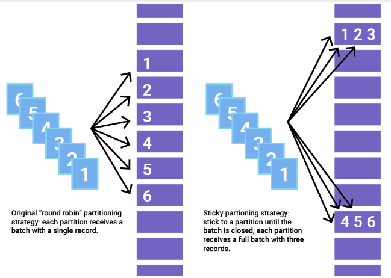
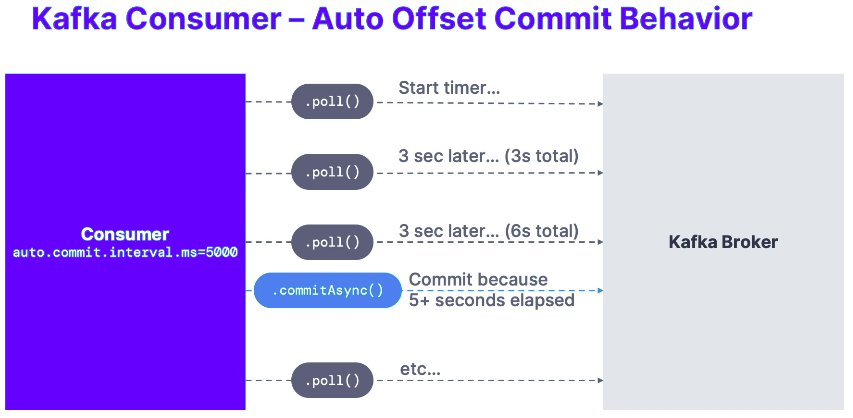

# Kafka programming with Java
## 1. Kafka Client libraries SDKs
- **<ins>About / Introduction</ins>**
  - We can use kafka client libraries to develop application client to communicate with Kafka server as a producer/consumer.
- **<ins>Java SDKs</ins>**
  - **The official client library:** *Low-level client*
    - **Gradle:**
        ```json
            // https://mvnrepository.com/artifact/org.apache.kafka/kafka-clients
            implementation 'org.apache.kafka:kafka-clients:3.9.0'
        ```
    - **Maven:**
        ```xml
            <!-- https://mvnrepository.com/artifact/org.apache.kafka/kafka-clients -->
            <dependency>
                <groupId>org.apache.kafka</groupId>
                <artifactId>kafka-clients</artifactId>
                <version>3.9.0</version> <!-- check for latest release / compatibe version -->
            </dependency>
        ```
  - **The official Kafka Streams client library:** *To create your Kafka Streams application*
    - **Gradle:**
        ```json
              // https://mvnrepository.com/artifact/org.apache.kafka/kafka-streams
              implementation 'org.apache.kafka:kafka-streams:3.9.0'
        ```
    - **Maven:**
        ```xml
            <!-- https://mvnrepository.com/artifact/org.apache.kafka/kafka-streams -->
            <dependency>
                <groupId>org.apache.kafka</groupId>
                <artifactId>kafka-streams</artifactId>
                <version>3.9.0</version>
            </dependency>
        ```
  - **Kafka for Spring Boot:** Applies Spring concepts to Kafka development
    - **Reference:** [https://spring.io/projects/spring-kafka#overview](https://spring.io/projects/spring-kafka#overview)
    - **Gradle:**
        ```gradle
            // https://mvnrepository.com/artifact/org.springframework.kafka/spring-kafka
            implementation 'org.springframework.kafka:spring-kafka:3.3.1'
        ```
    - **Maven:**
        ```xml
          <dependency>
            <groupId>org.springframework.kafka</groupId>
            <artifactId>spring-kafka</artifactId>
          </dependency>
        ```
  - **Spring Cloud Stream:** Bindings for Kafka Stream
    - **Reference:** [https://spring.io/projects/spring-cloud-stream](https://spring.io/projects/spring-cloud-stream)
    - **Gradle:**
        ```gradle
            // https://mvnrepository.com/artifact/org.springframework.cloud/spring-cloud-stream
            implementation 'org.springframework.cloud:spring-cloud-stream:4.2.0'
            
            // https://mvnrepository.com/artifact/org.springframework.cloud/spring-cloud-stream-binder-kafka
            implementation 'org.springframework.cloud:spring-cloud-stream-binder-kafka:4.2.0'

            // https://mvnrepository.com/artifact/org.springframework.kafka/spring-kafka
            implementation 'org.springframework.kafka:spring-kafka:3.3.1'
        ```
    - **Maven:**
        ```xml
          <dependency>
            <groupId>org.springframework.cloud</groupId>
            <artifactId>spring-cloud-stream</artifactId>
          </dependency>
          <dependency>
            <groupId>org.springframework.cloud</groupId>
            <artifactId>spring-cloud-stream-binder-kafka</artifactId>
          </dependency>
          <dependency>
            <groupId>org.springframework.kafka</groupId>
            <artifactId>spring-kafka</artifactId>
          </dependency>
        ```
  - **Akka Streams & Alpakka Kafka**
    - **Documentation:**
      - [https://doc.akka.io/libraries/akka-core/current/stream/index.html](https://doc.akka.io/libraries/akka-core/current/stream/index.html)
      - [https://doc.akka.io/libraries/alpakka-kafka/current/home.html](https://doc.akka.io/libraries/alpakka-kafka/current/home.html)
- **<ins>References:</ins>**
  - [https://learn.conduktor.io/kafka/kafka-sdk-list/](https://learn.conduktor.io/kafka/kafka-sdk-list/)
---

## 2. Kafka Client - Hello world
### Project ref: [a1-kafka-producer](https://github.com/SRVivek1/kafka-for-beginners-2024/tree/main/03-kafka-beginners-gradle/a1-kafka-producer)
- **<ins>Purpose / Feature</ins>**
  - This is xyz feature.
- **<ins>Steps</ins>**
  - ***Project Setup:*** 
    - Create a gradle project using intellij IDEA IDE or by visiting *https://start.spring.io/*.
    - Delete `src` folder from project home directory.
  - ***Step-1:*** Create a *new module* inside project.
    - **Steps:** Right Click on the project --> New --> Module
      - Select appropriate option on the given form and click *Create*.
  - ***Step-2:*** Add following dependencies.
     - **Kafka Clients:** *implementation("org.apache.kafka:kafka-clients:3.9.0")*
     - **Slf4j API:** *implementation("org.slf4j:slf4j-api:2.0.16")*
     - **Slf4j Simple:** *implementation("org.slf4j:slf4j-simple:2.0.16")*
   - ***Step-3:*** Create properties for target Kafka server.
   - ***Step-4:*** Cretae Kafka ProducerRecord with *Topic name* & *message* to be sent to topic.
   - ***Step-5:*** Create Kafka Producer object using the *kafka properties*.
   - ***Step-6:*** Pass the kafka record to *Kafka Producer* ***send(record)*** to send to topic.
   - ***Step-7:*** Flush the data using *producer* instance.
   - ***Step-8:*** Close the producer object/connection.
- **<ins>Gradle / External dependency</ins>**
  - Required dependency.
      ```groovy
            dependencies {
              implementation("org.apache.kafka:kafka-clients:3.9.0")
              implementation("org.slf4j:slf4j-api:2.0.16")
              implementation("org.slf4j:slf4j-simple:2.0.16")
              testImplementation(platform("org.junit:junit-bom:5.9.1"))
              testImplementation("org.junit.jupiter:junit-jupiter")
            }
      ```
- **<ins>Code / Config changes</ins>**
  - **Producer:** *KafkaProducerPoc.java*
    - imports
      - *import org.apache.kafka.clients.producer.KafkaProducer;*
      - *import org.apache.kafka.clients.producer.ProducerRecord;*
      - *import org.apache.kafka.common.serialization.StringSerializer;*
      - *import java.util.Properties;*
    - Producer class to publish data to topics.
      ```java
          public class KafkaProducerPoc {

            private static final Logger logger = LoggerFactory.getLogger(KafkaProducerPoc.class);

            public static void main(String[] args) {

                // Create properties wit kafka configuration
                final Properties properties = new Properties();
                properties.setProperty("bootstrap.servers", "[::1]:9092");
                properties.setProperty("key.serializer", StringSerializer.class.getName());
                properties.setProperty("value.serializer", StringSerializer.class.getName());

                // Create kafka record to encapsulate the data
                ProducerRecord<String, String> record1 = new ProducerRecord<>("demo_java", "Hello");
                ProducerRecord<String, String> record2 = new ProducerRecord<>("demo_java", "World");

                // Create Kafka producer
                final KafkaProducer<String, String> producer = new KafkaProducer<>(properties);

                producer.send(record1);
                producer.send(record2);

                //flush and close
                producer.flush();
                producer.close();
            }
        }
      ```
    - **Output: *Terminal*** *kafka-console-consumer.sh*
      ```properties
          TBU
      ```
- **<ins>References:</ins>**
  - [https://www.javatpoint.com/creating-kafka-producer-in-java](https://www.javatpoint.com/creating-kafka-producer-in-java)
---

## 3. Kafka Producers: callbacks
### Project ref: [a2-kafka-producer-with-callbacks](https://github.com/SRVivek1/kafka-for-beginners-2024/tree/main/03-kafka-beginners-gradle/a2-kafka-producer-with-callbacks)
- **<ins>Purpose / Feature</ins>**
  - The callback is a function passed when sending data to topic. This function is implemented for asynchronously handling the request completion, hence *void* return type.  
  - The callback function used by the producer is the *onCompletion()* with two arguments:
    - **Metadata of the Record:** 
      - Metadata of the record means fetching the information regarding the partition and its offsets. 
      - If it is not null, an error will be thrown.
    - **Exception:**
      - Following are two exceptions which can be thrown while processing:
        - **Retriable exception:** 
          - This exception says that the message may be sent.
        - **Non-retriable exception:** 
          - This exception throws the error that the message will never be sent.
- **<ins>Steps</ins>**
  - ***Project Setup:*** Develop kafka producer app.
    - Check *Section-2* for reference.
  - ***Step-1:*** Create and pass Kafka *Callback.java* class instance in send(...) method.
    - Add completion business logic inside *onCompletion(...)* method.
- **<ins>Gradle / External dependency</ins>**
  - Required dependency.
      ```groovy
            dependencies {
              implementation("org.apache.kafka:kafka-clients:3.9.0")
              implementation("org.slf4j:slf4j-api:2.0.16")
              implementation("org.slf4j:slf4j-simple:2.0.16")
            }
      ```
- **<ins>Code / Config changes</ins>**
  - **Producer:** *KafkaProducerPoc.java*
    - imports
      - *import org.apache.kafka.clients.producer.Callback;*
      - *import org.apache.kafka.clients.producer.ProducerConfig;*
    - Producer class to publish data to topics with *Callback instance*.
        ```java
            public class KafkaProducerWithCallbacks {

              private static final Logger logger = LoggerFactory.getLogger(KafkaProducerWithCallbacks.class);

              public static void main(String[] args) {
                  logger.info("KafkaProducerWithCallbacks execution started.");

                  final Properties properties = new Properties();
                  /*properties.setProperty("bootstrap.servers", "[::1]:9092");
                  properties.setProperty("key.serializer", StringSerializer.class.getName());
                  properties.setProperty("value.serializer", StringSerializer.class.getName());*/

                  properties.setProperty(ProducerConfig.BOOTSTRAP_SERVERS_CONFIG, "[::1]:9092");
                  properties.setProperty(ProducerConfig.KEY_SERIALIZER_CLASS_CONFIG, StringSerializer.class.getName());
                  properties.setProperty(ProducerConfig.VALUE_SERIALIZER_CLASS_CONFIG, StringSerializer.class.getName());

                  //Kafka producer
                  KafkaProducer<String, String> producer = new KafkaProducer<>(properties);

                  // send data and register callback for status
                  producer.send(new ProducerRecord<>("demo_java", "callback demo app"), new Callback() {
                      // Executes every time a message is successfully sent or exception occurs.
                      @Override
                      public void onCompletion(RecordMetadata recordMetadata, Exception e) {

                          // check if no exception occurred
                          if (e == null) {
                              logger.info("Received new metadata. \nTopic: {}, \nPartition: {}, \nOffset: {}, \nTimestamp: {}",
                                      recordMetadata.topic(), recordMetadata.partition(),
                                      recordMetadata.offset(), recordMetadata.timestamp());
                          } else {
                              logger.error("Error while producing: {}", e);
                          }
                      }
                  });
                  // flush and close
                  producer.flush();
                  producer.close();

                  logger.info("KafkaProducerWithCallbacks execution completed.");
              }
          }
        ```
    - **Output: ** *IDE Console*
    ```properties
        [kafka-producer-network-thread | producer-1] INFO com.srvivek.kafka.KafkaProducerWithCallbacks - Received new metadata. 
        Topic: demo_java, 
        Partition: 2, 
        Offset: 51, 
        Timestamp: 1736577123225
    ```
- **<ins>References:</ins>**
  - [https://www.javatpoint.com/kafka-producer-callbacks](https://www.javatpoint.com/kafka-producer-callbacks)
  - [https://www.confluent.io/blog/apache-kafka-producer-improvements-sticky-partitioner/](https://www.confluent.io/blog/apache-kafka-producer-improvements-sticky-partitioner/)
---

## 4. Kafka Producers: Inprovement using sticky partitioner
### Project ref: [a3-kafka-partitioner-demo](https://github.com/SRVivek1/kafka-for-beginners-2024/tree/main/03-kafka-beginners-gradle/a3-kafka-partitioner-demo)  
- **<ins>Purpose / Feature</ins>**
    - The amount of time it takes for a message to move through a system plays a big role in the performance of distributed systems like Apache Kafka.
      - In Kafka, the latency of the producer is often defined as the time it takes for a message produced by the client to be acknowledged by Kafka.
    - Each Kafka topic contains one or more partitions. When a Kafka producer sends a record to a topic, it needs to decide which partition to send it to. If we send several records to the same partition at around the same time, they can be sent as a batch.
      - Processing each batch requires a bit of overhead, with each of the records inside the batch contributing to that cost. Records in smaller batches have a higher effective cost per record. Generally, smaller batches lead to more requests and queuing, resulting in higher latency.
    - A batch is completed either when it reaches a certain size (batch.size) or after a period of time (linger.ms) is up. Both batch.size and linger.ms are configured in the producer. 
      - The default for ***batch.size*** is *16,384 bytes*, and the default of ***linger.ms*** is *0* milliseconds. 
      - Once batch.size is reached or at least linger.ms time has passed, the system will send the batch as soon as it is able.
    - Even when linger.ms is 0, the producer will group records into batches when they are produced to the same partition around the same time. This is because the system needs a bit of time to handle each request, and batches form when the system cannot attend to them all right away.
  - **Partitioning strategy** 
    - If records are not sent to the same partition, they cannot form a batch together. 
    - Kafka producers can configuring a Partitioner class to select partitioning strategy. 
      - The Partitioner assigns the partition for each record.
      - The default behavior is to hash the key of a record to get the partition, but some records may have a key that is null. 
        - In this case, the old partitioning strategy before Apache Kafka 2.4 would be to cycle through the topic’s partitions and send a record to each one.
        -  Unfortunately, this method does not batch very well and may in fact add latency. Due to the potential for increased latency with small batches, the original strategy for partitioning records with null keys can be inefficient. 
        -  This changes with Apache Kafka 2.4, which introduces ***sticky partitioning***, a new strategy for assigning records to partitions with proven lower latency.
   - **Sticky partitioning strategy:**
   - The sticky partitioner addresses the problem of spreading out records without keys into smaller batches by picking a single partition to send all non-keyed records. 
     - Once the batch at that partition is filled or otherwise completed, the sticky partitioner randomly chooses and “sticks” to a new partition. 
     - That way, over a larger period of time, records are about evenly distributed among all the partitions while getting the added benefit of larger batch sizes.
   - In order to change the sticky partition, Apache Kafka 2.4 also adds a new method called *onNewBatch* to the *Partitioner interface* for use right before a new batch is created, which is the perfect time to change the sticky partition. *DefaultPartitioner* implements this feature.
     <center>
      
    </center>
- **<ins>Steps</ins>**
  - ***Project Setup:*** Refer *Section-2 & 3* for project setup.
  - ***Step-1:*** Update ProducerConfig properties.
    - **Partitioner Class:** 
      - *properties.setProperty(ProducerConfig.PARTITIONER_CLASS_CONFIG, RoundRobinPartitioner.class.getName());*
    - **Batch Size:**
      - *properties.setProperty(ProducerConfig.BATCH_SIZE_CONFIG, "500");*
- **<ins>Gradle / External dependency</ins>**
  - Required dependency.
      ```groovy
            dependencies {
              implementation("org.apache.kafka:kafka-clients:3.9.0")
              implementation("org.slf4j:slf4j-api:2.0.16")
              implementation("org.slf4j:slf4j-simple:2.0.16")
            }
      ```
- **<ins>Code / Config changes</ins>**
  - **Kafka Producer:** *KafkaProducerPartitionerPoc.java*
    - imports
      - *import org.apache.kafka.clients.producer.RoundRobinPartitioner;*
    - Configure Batch size and Partitioner class.
      ```java
          public class KafkaProducerPartitionerPoc {

            private static final Logger logger = LoggerFactory.getLogger(KafkaProducerPartitionerPoc.class);

            public static void main(String[] args) {

                logger.info("execution started for main(...)");

                Properties properties = new Properties();
                properties.setProperty(ProducerConfig.BOOTSTRAP_SERVERS_CONFIG, "[::1]:9092");
                properties.setProperty(ProducerConfig.KEY_SERIALIZER_CLASS_CONFIG, StringSerializer.class.getName());
                properties.setProperty(ProducerConfig.VALUE_SERIALIZER_CLASS_CONFIG, StringSerializer.class.getName());

                // RoundRobin partitioner (Not rec. for PROD.)- send messages to each queue
                // Note: keep partitioner default as per kafka config
                properties.setProperty(ProducerConfig.PARTITIONER_CLASS_CONFIG, RoundRobinPartitioner.class.getName());

                //set batch size
                // Note: keep it default as per kafka config
                properties.setProperty(ProducerConfig.BATCH_SIZE_CONFIG, "500");

                final KafkaProducer<String, String> producer = new KafkaProducer<>(properties);

                // send data in multiple batches
                for (int i = 0; i < 10; i++) {
                    for (int j = 0; j < 30; j++) {
                        producer.send(new ProducerRecord<>("demo_java", String.format("Message: Hello World testing partitioner in kafka. Test [i: %s, j: %s]", i, j)), new Callback() {
                            @Override
                            public void onCompletion(RecordMetadata recordMetadata, Exception e) {
                                if (e == null) {
                                    logger.info("Record Metadata. \nTopic: {} \nPartition: {} \nOffset: {} \nTimestamp: {} \n",
                                            recordMetadata.topic(), recordMetadata.partition(),
                                            recordMetadata.offset(), recordMetadata.timestamp());
                                } else {
                                    logger.error("Error: {}", e.getStackTrace());
                                }
                            }
                        });
                        producer.flush();
                    }
                    // sleep thread for 500ms
                    try {
                        logger.info("Thread will sleep for 500ms.");
                        Thread.sleep(500);
                    } catch (InterruptedException e) {
                        throw new RuntimeException(e);
                    }
                }
                producer.close();
                logger.info("execution completed for main(...)");
            }
        }
      ```
    - **Output:** *IDE Console*
      ```properties
          # FYI - it will send data to each parition in batches as batch theshhold is reached.
      ```
- **<ins>References:</ins>**
  - [https://www.redpanda.com/guides/kafka-tutorial-kafka-partition-strategy](https://www.redpanda.com/guides/kafka-tutorial-kafka-partition-strategy)
  - [https://www.confluent.io/blog/apache-kafka-producer-improvements-sticky-partitioner/](https://www.confluent.io/blog/apache-kafka-producer-improvements-sticky-partitioner/)
---

## 5. Kafka Producer: Choose partition in topic using *key* in record
### Project ref: [a1-kafka-producer](https://github.com/SRVivek1/kafka-for-beginners-2024/tree/main/03-kafka-beginners-gradle/a1-kafka-producer)
- **<ins>About / Introduction</ins>**
  - Along side the message value, we can choose to send a message key and that key could be a string, a number etc type.
    - This is an important property of Kafka which helps us to preserve the ordering for messages with specific field by passing same key for these kind of messages by sending all the messages that share the same key to the same partition.
    - When we don’t send the key, the key is set to *null* and the data will be sent to randomly selected patition as *Partitioning class / strategy*. 
- **<ins>Steps</ins>**
  - ***Project Setup:*** Create Kafka Producer application.
    - Refer above *section-2 to 4* for project setup. 
  - ***Step-1:*** Update *ProducerRecord* to include *key* along with *message* & *topic name*.
    - *ProducerRecord<String, String> record = new ProducerRecord<>(TOPIC, key, message)*
- **App:** *KafkaProducerRecordWithKeys.java*
  ```java
     public class KafkaProducerRecordWithKeys {
       private static final Logger logger = LoggerFactory.getLogger(KafkaProducerRecordWithKeys.class);
       public static void main(String[] args) {
           logger.info("Execution started for main(...)");
           final Properties properties = new Properties();
           properties.setProperty(ProducerConfig.BOOTSTRAP_SERVERS_CONFIG, "[::1]:9092");
           properties.setProperty(ProducerConfig.KEY_SERIALIZER_CLASS_CONFIG, StringSerializer.class.getName());
           properties.setProperty(ProducerConfig.VALUE_SERIALIZER_CLASS_CONFIG, StringSerializer.class.getName());
           final KafkaProducer<String, String> producer = new KafkaProducer<>(properties);
           final String TOPIC = "demo_java";
           // Send data
           for (int j = 0; j < 10; j++) {
               for (int i = 0; i < 10; i++) {
                   String key = "id_" + i;
                   String message = "hello world - " + i;
                   producer.send(new ProducerRecord<>(TOPIC, key, message), new Callback() {
                       @Override
                       public void onCompletion(RecordMetadata recordMetadata, Exception e) {
                           if (e == null) {
                               logger.info("Record: Key: {}, Partition: {}", key, recordMetadata.partition());
                           } else {
                               logger.error("Stacktrace:\n{}", e.getStackTrace());
                           }
                       }
                   });
                   producer.flush();
               }
               // sleep thead to create bataches
               try {
                   Thread.sleep(1000);
               } catch (InterruptedException e) {
                   throw new RuntimeException(e);
               }
           }
           producer.close();
           logger.info("Execution completed for main(...)");
       }
   }
  ```
- **<ins>References:</ins>**
  - [https://www.geeksforgeeks.org/apache-kafka-message-keys/](https://www.geeksforgeeks.org/apache-kafka-message-keys/)

---
## 6. Kafka Consumer: Read data from topic
### Project ref: [a4-kafka-consumer](https://github.com/SRVivek1/kafka-for-beginners-2024/tree/main/03-kafka-beginners-gradle/a4-kafka-consumer)
- **<ins>Purpose / Feature</ins>**
  - An Apache Kafka® Consumer is a client application that subscribes to (reads and processes) events from Kafka Topics.
  - The Kafka consumer works by issuing “fetch” requests to the brokers (kafka server) leading the partitions it wants to consume. 
    - The consumer offset is specified in the log with each request. 
    - The consumer receives back a chunk of log that contains all of the messages in that topic beginning from the offset position. 
    - The consumer has significant control over this position and can rewind it to re-consume data if desired.
  - To use the *subscribe* or *commit* methods provided by the KafkaConsumer API, we must assign the consumer to a *consumer group* by setting the ***group.id*** property. 
    - If consumer is not part of any group, then an exception is thrown when these methods are called.
  - **Offset management:**
    - After the consumer receives its assignment from the coordinator, it must determine the initial position for each assigned partition. 
    - When the group is first created, before any messages have been consumed, the position is set according to a configurable offset reset policy (auto.offset.reset). 
      - Typically, consumption starts either at the *earliest offset* or the *latest offset*.
    - **Property: *auto.offset.reset:***
      - Following are 3 possible values:
        - **none:** *Fail if the consumer group doesn't exists.*
        - **earliest:** *Read events from beginning*
        - **latest:** *Read new messages/events*
- **<ins>Steps</ins>**
   - ***Project Setup:*** 
    - Create a gradle project using intellij IDEA IDE or by visiting *https://start.spring.io/*.
    - Delete `src` folder from project home directory.
  - ***Step-1:*** Create a *new module* inside project.
    - **Steps:** Right Click on the project --> New --> Module
      - Select appropriate option on the given form and click *Create*.
  - ***Step-2:*** Add following dependencies.
     - **Kafka Clients:** *implementation("org.apache.kafka:kafka-clients:3.9.0")*
     - **Slf4j API:** *implementation("org.slf4j:slf4j-api:2.0.16")*
     - **Slf4j Simple:** *implementation("org.slf4j:slf4j-simple:2.0.16")*
   - ***Step-3:*** Create properties for target Kafka server.
   - ***Step-4:*** Add properties for Consumer Configs e.g. key and value deserializer, group id etc.
   - ***Step-5:*** Add Consumer config property *auto.offset.reset*
   - ***Step-6:*** Create *KafkaConsumer* instance.
   - ***Step-7:*** Create shutdown hook to current *Runtime* and join the Main Thread.
     - *kafkaConsumer.wakeup():* Once this API is called, *Consumer* will throws exception on next *poll(..)* API invocation.
       - **kafkaConsumer.wakeup():**
         - Wakeup the consumer. This method is thread-safe and is useful in particular to abort a long poll. 
         - The thread which is blocking in an operation will throw *org.apache.kafka.common.errors.WakeupException*.
         - If no thread is blocking in a method which can throw *org.apache.kafka.common.errors.WakeupException*, the next call to such a method will raise it instead.
   - ***Step-8*** Handle *WakeupException* with *poll(..)* call and process graceful shutdown.
   - ***Step-9:*** Subscribe to kafka topic using *KafkaConsumer.subscribe(..) API*.
   - ***Step-10:*** Poll for the data using *KafkaConsumer.poll(..) API*.
   - ***Step-11:*** Iterate over the *ConsumerRecord* list and process it.
   - ***Step-12:*** Graceful shudown of java app
     - **1.** Attach *shutdownHook* to *Runtime* and pass a new thread to call *kafkaConsumer.wakeup()*, which will raise *WakeupException* if *poll(..)* is called.
     - **2.** Catch the exception and close open resources of kafka.
- **<ins>Code </ins>**
  - **Consumer:** *KafkaConsumerApp.java*
    - imports
      ```java
          import org.apache.kafka.clients.consumer.ConsumerConfig;
          import org.apache.kafka.clients.consumer.ConsumerRecord;
          import org.apache.kafka.clients.consumer.ConsumerRecords;
          import org.apache.kafka.clients.consumer.KafkaConsumer;
          import org.apache.kafka.common.errors.WakeupException;
      ```
    - Kafka Consumer class to poll messages from kafka.
    	```java
          public class KafkaConsumerApp {

            private static final Logger logger = LoggerFactory.getLogger(KafkaConsumerApp.class);
            private static final String GROUP_ID = "my-java-app-consumers";
            private static final String TOPIC = "demo_java";

            /**
            * Kafka consumer configuration
            */
            private static Properties getKafkaConfig() {

                final Properties properties = new Properties();
                properties.setProperty(ConsumerConfig.BOOTSTRAP_SERVERS_CONFIG, "[::1]:9092");
                properties.setProperty(ConsumerConfig.KEY_DESERIALIZER_CLASS_CONFIG, StringDeserializer.class.getName());
                properties.setProperty(ConsumerConfig.VALUE_DESERIALIZER_CLASS_CONFIG, StringDeserializer.class.getName());

                // set application group id
                properties.setProperty(ConsumerConfig.GROUP_ID_CONFIG, GROUP_ID);

                // Read config
                //Read only new messages
                // properties.setProperty(ConsumerConfig.AUTO_OFFSET_RESET_CONFIG, "latest");
                // --> fail if consumer group doesn't exist
                // properties.setProperty(ConsumerConfig.AUTO_OFFSET_RESET_CONFIG, "none");
                // --> Read from beginning
                properties.setProperty(ConsumerConfig.AUTO_OFFSET_RESET_CONFIG, "earliest");

                // Don't create topics if not found.
                properties.setProperty(ConsumerConfig.ALLOW_AUTO_CREATE_TOPICS_CONFIG, Boolean.toString(false));

                return properties;
            }

            public static void main(String[] args) {

                logger.info("Execution started of main(...)");

                // Create consumer
                KafkaConsumer<String, String> kafkaConsumer = new KafkaConsumer<>(getKafkaConfig());

                //Add shutdown hook to gracefully close the consumer
                final Thread mainThread = Thread.currentThread();
                Runtime.getRuntime().addShutdownHook(new Thread() {
                    @Override
                    public void run() {
                        logger.info("Detected shutdown. calling to initiate shutdown.");
                        kafkaConsumer.wakeup();

                        try {
                            mainThread.join();
                        } catch (InterruptedException e) {
                            logger.error("Shutdown error while waiting for consumer to close resources. Message: {}", e.getMessage());
                            e.printStackTrace();
                            throw new RuntimeException(e);
                        }
                    }
                });

                try {
                    //subscribe
                    kafkaConsumer.subscribe(List.of(TOPIC));

                    // Poll for events
                    while (true) {

                        logger.info("Polling.................");
                        // The maximum time to block.
                        // Must not be greater than Long.MAX_VALUE milliseconds.
                        final ConsumerRecords<String, String> records = kafkaConsumer.poll(Duration.ofMillis(1000));

                        for (ConsumerRecord<String, String> record : records) {
                            logger.info("Key: {}, Value: {}", record.key(), record.value());
                            logger.info("Partition: {}, Offset: {}", record.partition(), record.offset());
                        }
                    }
                } catch (WakeupException we) {
                    logger.info("Started shutdown for consumer.");
                } catch (Exception e) {
                    logger.error("Unexpected error in consumer. Message: {}", e.getMessage());
                    e.printStackTrace();
                } finally {
                    kafkaConsumer.close();
                    logger.info("Consumer is now gracefully shutdown.");
                }
                logger.info("Execution completed of main(...)");
            }
        }
      ```
- **<ins>References:</ins>**
  - [https://docs.confluent.io/platform/current/clients/consumer.html](https://docs.confluent.io/platform/current/clients/consumer.html)
---

## 7. Kafka Consumer group and partition rebalancing
### Project ref: [a4-kafka-consumer](https://github.com/SRVivek1/kafka-for-beginners-2024/tree/main/03-kafka-beginners-gradle/a4-kafka-consumer)
- **<ins>About / Introduction</ins>**
  - The concept of rebalancing is fundamental to Kafka's consumer group architecture. When a consumer group is created, the group coordinator assigns partitions to each consumer in the group. Each consumer is responsible for consuming data from its assigned partitions. 
  - However, as consumers join or leave the group or new partitions are added to a topic, the partition assignments become unbalanced. This is where rebalancing comes into play.
    - Kafka rebalancing is the process by which Kafka redistributes partitions across consumers to ensure that each consumer is processing an approximately equal number of partitions. 
    - This ensures that data processing is distributed evenly across consumers and that each consumer is processing data as efficiently as possible. 
    - As a result, Kafka can scale efficiently and effectively, preventing any single consumer from becoming overloaded or underused.
    - Kafka default strategy uses ["o.a.k.c.consumer.RangeAssignor, "o.a.k.c.consumer.CooperativeStickyAssignor"].
      - *RangeAssignor* has priority over other.
  - **Rebalacing:**
    - ***Eager Rebalance***
      - All consumers are stopped and giveup their membership of partitions.
      - They rejoin the consumer group and get a new partition assignment.
        - During this rejoining process entire consumer gropu stops processing, commonly called a “*stop the world effect*”. This causes delays and interruptions in data processing.
        - There's no gurantee that consumers will get the same pastitions assignmend again.
      - **How to use ?**
        - Set Kafka Consumer configuration *partition.assignment.strategy*.
          - *RangeAssignor:* 
            - Assigns partition on per-topic basis (can lead to imbalance).
          - *RoundRobin:*
            - Assigns partitions across all topics in round-robin fashion (optimal balance).
          - *StickyAssignor:*
            - Balanced like *RoundRobin* and minimizes parition movements when consumer joins or leaves the group.
    - ***Cooperative (Incremental) Rebalance:*** - *Recommended*
      - Incremental cooperative rebalance protocol was introduced in Kafka 2.4 to minimize the disruption caused by Kafka rebalancing.
      - In this strategy rebalancing is split into smaller sub-tasks, and consumers continue consuming data while these sub-tasks are completed. As a result, rebalancing occurs more quickly and with less interruption to data processing.
      - It can go through several itertions to find a stable assignment (hence incremental).
      - The protocol also provides more fine-grained control over the rebalancing process. 
        - ***For example,*** it allows consumers to negotiate the specific set of partitions they will consume based on their current load and capacity. This prevents the overloading of individual consumers and ensures that partitions are assigned in a more balanced way.
      - **How to use ?**
        - Set Kafka Consumer configuration *partition.assignment.strategy*.
          - *CooperativeStickyAssignor*
            - Identical to *StickyAssignor* but supports *cooperative rebalance* and therefore consumers can keep consuming from the Topic.
  - **How rebalancing works**
    - Kafka provides several partition assignment strategies to determine how partitions are assigned during a rebalance and is called an “assignor”. 
    - The default partition assignment strategy is round-robin, where Kafka assigns partitions to consumers one after another. 
    - However, Kafka also provides “range” and “cooperative sticky” assignment strategies, which may be more appropriate for specific use cases.
  - **When a rebalance occurs:**
    - Kafka notifies each consumer in the group by sending a GroupCoordinator message.
    - Each consumer then responds with a JoinGroup message, indicating its willingness to participate in the rebalance.
    - Kafka then uses the selected partition assignment strategy to assign partitions to each consumer in the group.
    - **Note:** 
      - During a rebalance, Kafka may need to pause data consumption temporarily. 
      - This is necessary to ensure all consumers have an up-to-date view of the partition assignments before re-consuming data.
  - **What triggers Kafka rebalancing ?**
    - *Consumer joins or leaves*
    - *Temporary consumer failure*
    - *Consumer idle for too long*
    - *Topic partitions added*
  - **Side effects of Kafka rebalancing**
    - *Increased latency*
    - *Reduced throughput*
    - *Increased resource usage*
    - *Increased complexity*
    - *Potential data duplication and loss*
  - **Measures to reduce rebalancing:**
    - *Increase session timeout*
      - The session timeout is the maximum time for a Kafka consumer to send a heartbeat to the broker.
      - Increasing the session timeout increases the time a broker waits before marking a consumer as inactive. 
        - Set the *session.timeout.ms* parameter to a higher value in the Kafka client configuration to increate session timeout. 
        - However, setting this parameter too high leads to longer periods of consumer inactivity.
    - *Reduce partitions per topic*
      - Having too many partitions per topic increases the frequency of rebalancing. 
      - When creating a topic, set the partition number by setting the *num.partitions* parameter to a lower value. 
        - However, reducing the number of partitions also reduces the parallelism and throughput of your Kafka cluster.
    - *Increase poll interval time*
      - Sometimes messages take longer to process due to multiple network or I/O calls involved in processing failures and retries. In such cases, the consumer may be removed from the group frequently. 
      - Set the consumer configuration *max.poll.interval.ms* with the maximum time the consumer can be idle before it is considered inactive and removed from the group. 
      - Increasing the max.poll.interval.ms value in the consumer config helps avoid frequent consumer group changes.
  - **Static group membership rebalancing?  *-- Not Recommended*** 
    - It's a method of assigning Kafka partitions to consumers in a consumer group in a fixed and deterministic way without relying on automatic partition assignment. 
      - In this approach, the developer defines the partition assignment explicitly instead of letting the Kafka broker manage it dynamically.
    - With static group membership, consumers in a consumer group explicitly request the Kafka broker to assign them specific partitions by specifying the partition IDs in their configuration. 
    - Each consumer only consumes messages from a specific subset of partitions, and the partition assignment remains fixed until explicitly changed by the consumer.
      - *However, it's important to note that static group membership leads to ***uneven workload distribution*** among consumers and may only be suitable for some use cases*.
      - **Note:** This is helpful when sonsumers maintain local state and cache (to avoid re-building the cache).
    - **How to use ?:**
      - Set the configuration *group.instance.id* to make a consumer a static member. 
      - The same partition will be assigned to consumer if it rejoins before the session timeout *session.timeout.ms*.

- **Code changes**
  - ***Imports:***
    - *import org.apache.kafka.clients.consumer.CooperativeStickyAssignor;*
  - ***Consumer app: *** **
    ```java
        public class KafkaConsumerIncrementalRebalancingApp {

          private static final Logger logger = LoggerFactory.getLogger(KafkaConsumerIncrementalRebalancingApp.class);
          private static final String GROUP_ID = "my-java-app-consumers";
          private static final String TOPIC = "demo_java";

          /**
           * Kafka consumer configuration
          */
          private static Properties getKafkaConfig() {

              final Properties properties = new Properties();
              properties.setProperty(ConsumerConfig.BOOTSTRAP_SERVERS_CONFIG, "[::1]:9092");
              properties.setProperty(ConsumerConfig.KEY_DESERIALIZER_CLASS_CONFIG, StringDeserializer.class.getName());
              properties.setProperty(ConsumerConfig.VALUE_DESERIALIZER_CLASS_CONFIG, StringDeserializer.class.getName());

              // set application group id
              properties.setProperty(ConsumerConfig.GROUP_ID_CONFIG, GROUP_ID);

              // Read config --> earliest: Read from beginning
              properties.setProperty(ConsumerConfig.AUTO_OFFSET_RESET_CONFIG, "earliest");

              // Don't create topics if not found.
              properties.setProperty(ConsumerConfig.ALLOW_AUTO_CREATE_TOPICS_CONFIG, Boolean.toString(false));

              // CooperativeStickyAssignor : Incremental repartitioning
              properties.setProperty(ConsumerConfig.PARTITION_ASSIGNMENT_STRATEGY_CONFIG, CooperativeStickyAssignor.class.getName());
              return properties;
          }

          public static void main(String[] args) {

              logger.info("Execution started of main(...)");

              // Create consumer
              KafkaConsumer<String, String> kafkaConsumer = new KafkaConsumer<>(getKafkaConfig());

              //Add shutdown hook to gracefully close the consumer
              final Thread mainThread = Thread.currentThread();
              Runtime.getRuntime().addShutdownHook(new Thread() {
                  @Override
                  public void run() {
                      logger.info("Detected shutdown. calling to initiate shutdown.");
                      kafkaConsumer.wakeup();

                      try {
                          mainThread.join();
                      } catch (InterruptedException e) {
                          logger.error("Shutdown error while waiting for consumer to close resources. Message: {}", e.getMessage());
                          e.printStackTrace();
                          throw new RuntimeException(e);
                      }
                  }
              });

              try {
                  //subscribe
                  kafkaConsumer.subscribe(List.of(TOPIC));

                  // Poll for events
                  while (true) {

                      logger.info("Polling...");
                      // The maximum time to block.
                      // Must not be greater than Long.MAX_VALUE milliseconds.
                      final ConsumerRecords<String, String> records = kafkaConsumer.poll(Duration.ofMillis(1000));

                      for (ConsumerRecord<String, String> record : records) {
                          logger.info("Key: {}, Value: {}", record.key(), record.value());
                          logger.info("Partition: {}, Offset: {}", record.partition(), record.offset());
                      }
                  }
              } catch (WakeupException we) {
                  logger.info("Started shutdown for consumer.");
              } catch (Exception e) {
                  logger.error("Unexpected error in consumer. Message: {}", e.getMessage());
                  e.printStackTrace();
              } finally {
                  kafkaConsumer.close();
                  logger.info("Consumer is now gracefully shutdown.");
              }
              logger.info("Execution completed of main(...)");
          }
      }
    
    ```
- **<ins>References:</ins>**
  - [https://www.redpanda.com/guides/kafka-performance-kafka-rebalancing](https://www.redpanda.com/guides/kafka-performance-kafka-rebalancing)

---

## 8. Kafka Consumer:Auto offset commit behavior
### Project ref: [a4-kafka-consumer](https://github.com/SRVivek1/kafka-for-beginners-2024/tree/main/03-kafka-beginners-gradle/a4-kafka-consumer)
- **<ins>About / Introduction</ins>**
  - In Java consuer API, consumer offsets are regularly committed.
  - Enable at-least once reading scenatio by default (under condition).
    - Offsets are committed when *poll(..)* API is called and *auto.commit.interval.ms* has elapsed.
    - **e.g.:** *auto.commit.interval.ms=5000* and *enable.auto.commit=true* the it will commit every 5 seconds.
    - **Note:** Ensure all messages are processed before making *poll()* API call. Otherwise we'll not be in at-least once reading scenario.
  - **Manual offset commit:** *(Advance)*
    - In order to commit manually.
      - Set *enable.auto.commit=false*
      - Set *auto.commit.interval.ms=5000*
      - Add custom logic to commit offset on a desired time-interval using *commitSync(..)* or *commitAsync(...)* APIs.
  - **Commiting offsets:**
    <center>
      
    </center>
- **Code changes:**
  - ***Code:*** **
    ```java
        public class KafkaConsumerManualOffsetCommitApp {

          private static final Logger logger = LoggerFactory.getLogger(KafkaConsumerIncrementalRebalancingApp.class);
          private static final String GROUP_ID = "my-java-app-consumers";
          private static final String TOPIC = "demo_java";

          /**
           * Kafka consumer configuration
          */
          private static Properties getKafkaConfig() {

              final Properties properties = new Properties();
              properties.setProperty(ConsumerConfig.BOOTSTRAP_SERVERS_CONFIG, "[::1]:9092");
              properties.setProperty(ConsumerConfig.KEY_DESERIALIZER_CLASS_CONFIG, StringDeserializer.class.getName());
              properties.setProperty(ConsumerConfig.VALUE_DESERIALIZER_CLASS_CONFIG, StringDeserializer.class.getName());

              // set application group id
              properties.setProperty(ConsumerConfig.GROUP_ID_CONFIG, GROUP_ID);

              // Read config --> earliest: Read from beginning
              properties.setProperty(ConsumerConfig.AUTO_OFFSET_RESET_CONFIG, "earliest");

              // Don't create topics if not found.
              properties.setProperty(ConsumerConfig.ALLOW_AUTO_CREATE_TOPICS_CONFIG, Boolean.toString(false));

              // CooperativeStickyAssignor : Incremental repartitioning
              properties.setProperty(ConsumerConfig.PARTITION_ASSIGNMENT_STRATEGY_CONFIG, CooperativeStickyAssignor.class.getName());

              // Auto commit interval ms
              properties.setProperty(ConsumerConfig.AUTO_COMMIT_INTERVAL_MS_CONFIG, "5000");

              // disable auto commit for offset
              properties.setProperty(ConsumerConfig.ENABLE_AUTO_COMMIT_CONFIG, Boolean.toString(Boolean.FALSE));

              return properties;
          }

          public static void main(String[] args) {

              logger.info("Execution started of main(...)");

              // Create consumer
              KafkaConsumer<String, String> kafkaConsumer = new KafkaConsumer<>(getKafkaConfig());

              //Add shutdown hook to gracefully close the consumer
              final Thread mainThread = Thread.currentThread();
              Runtime.getRuntime().addShutdownHook(new Thread() {
                  @Override
                  public void run() {
                      logger.info("Detected shutdown. calling to initiate shutdown.");
                      kafkaConsumer.wakeup();

                      try {
                          mainThread.join();
                      } catch (InterruptedException e) {
                          logger.error("Shutdown error while waiting for consumer to close resources. Message: {}", e.getMessage());
                          e.printStackTrace();
                          throw new RuntimeException(e);
                      }
                  }
              });

              try {
                  //subscribe
                  kafkaConsumer.subscribe(List.of(TOPIC));

                  // Poll for events
                  while (true) {

                      logger.info("Polling.................");
                      // The maximum time to block.
                      // Must not be greater than Long.MAX_VALUE milliseconds.
                      final ConsumerRecords<String, String> records = kafkaConsumer.poll(Duration.ofMillis(1000));

                      for (ConsumerRecord<String, String> record : records) {
                          logger.info("Key: {}, Value: {}", record.key(), record.value());
                          logger.info("Partition: {}, Offset: {}", record.partition(), record.offset());
                      }

                      // Manual commit async
                      kafkaConsumer.commitAsync();
                  }
              } catch (WakeupException we) {
                  logger.info("Started shutdown for consumer.");
              } catch (Exception e) {
                  logger.error("Unexpected error in consumer. Message: {}", e.getMessage());
                  e.printStackTrace();
              } finally {
                  kafkaConsumer.close();
                  logger.info("Consumer is now gracefully shutdown.");
              }
              logger.info("Execution completed of main(...)");
          }
      }
    ```
---
------------------------------------------------ END ------------------------------------------------
---
